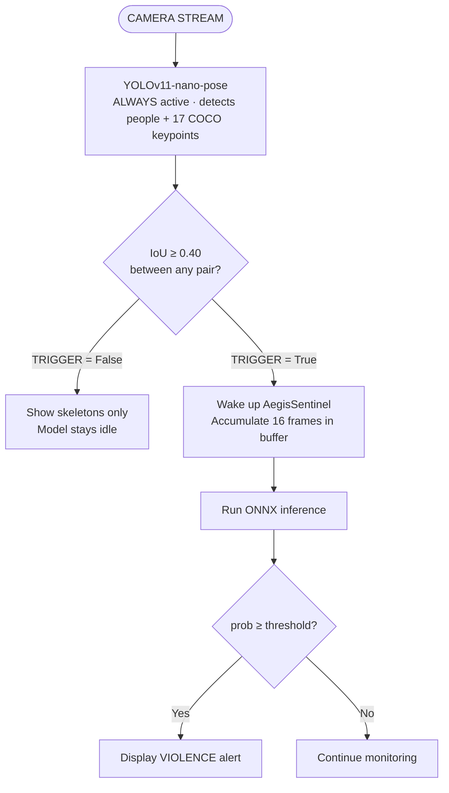
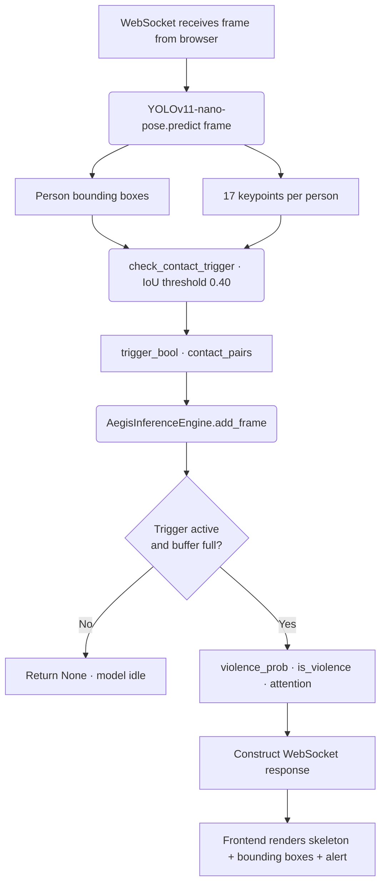

# Aegis-Sentinel-Net

## Executive Summary
Aegis-Sentinel-Net is an advanced computer vision and video understanding solution engineered for real-time automated security monitoring and threat detection. The system leverages state-of-the-art deep learning architectures to execute violent contact detection between individuals, real-time weapon classification, and spatial telemetry tracking. By combining spatial feature extraction with a high-performance temporal attention mechanism, Aegis-Sentinel-Net provides high-fidelity, low-latency analytics designed for critical urban, institutional, and industrial environments.

## Core Capabilities

* **Automated Violence Detection:** Binary classification of human interactions (Violence vs. Non-Violence) by using temporal attention profiles over continuous frame sequences.
* **Real-Time Weapon Detection:** Concurrent localization and classification of high-risk objects, specifically optimized for handguns, knives, and rifles.
* **Telemetry HUD Overlay:** Real-time extraction of human skeletal keypoints projected onto a high-tech Cyberpunk HUD interface for enhanced operator tracking and visual telemetric telemetry.

## System Architecture & UI Design
The platform is designed around a modular architecture that separates data ingestion, machine learning inference, and presentation layers. 

The frontend implements a high-performance **Cyberpunk HUD Console (Silver Neon)** aesthetic. It utilizes real-time canvas rendering to superimpose skeletal tracking matrices and bounding boxes over hardware-accelerated video streams, accompanied by dynamic analytical charting for threat level monitoring.

### Production Tech Stack
* **Core Intelligence:** Python 3.11, PyTorch, ONNX Runtime (Execution Providers optimized for CUDA).
* **Object Detection & Pose Estimation:** YOLOv11-nano, YOLOv11-nano-pose.
* **Backend Ingestion Engine:** FastAPI, OpenCV, NumPy, Pydantic v2.
* **Data Persistence:** PostgreSQL.
* **Infrastructure Containerization:** Docker, Docker-Compose.
* **Frontend Analytics:** TypeScript, ReactJS, Axios, Recharts, Tailwind CSS, Vite.

## Technical Specifications & Model Implementations

### 1. AegisSentinel-Net (Primary Classification Model)
The primary video understanding backbone consists of a hybrid **ResNet50 + Multi-Layer Attention Perceptron (Att-MLP)** architecture. 
* **Design Rationale:** The traditional recurrent approach (LSTM) was replaced with a custom Multi-Layer Attention Perceptron. This engineering decision eliminates hidden-state serialization bottlenecks and recurrent dependency constraints inside the ONNX Runtime environment, drastically increasing inference throughput while maintaining complex cross-frame temporal alignment.
* **Dataset Characteristics:** Trained on a balanced dataset of 4,640 video sequences (3,950 training subset, 465 validation subset).

### 2. AegisWeaponNet
A localized single-shot object detector based on the **YOLOv11-nano** topology, optimized for inference speed and minimal VRAM footprints. It handles the localization and bounding-box regression for:
* Class 0: `gun` (Handguns and light firearms)
* Class 1: `knife` (Bladed weapons and sharp objects)
* Class 2: `rifle` (Assault rifles and long-range firearms)

### 3. AegisPoseHUD
A secondary **YOLOv11-nano-pose** model running concurrently to extract 17 keypoints of the human skeleton. These vectors are mapped onto the frontend console to drive the telemetric neon HUD overlay without interfering with the primary classification weights.

## Performance Metrics

| Model Backbone | Metric Type | Target Class / Task | Value |
| :--- | :--- | :--- | :--- |
| **ResNet50 + Att-MLP** | F1-Score | Binary Classification (Violence) | **0.935** |
| **ResNet50 + Att-MLP** | Validation Loss | Cross-Entropy Loss Ceiling | **0.275** |
| **YOLOv11-nano (Weapons)**| mAP@50 | Object Detection (Gen Urban) | **0.680** |
| **YOLOv11-nano (Weapons)**| Recall | Target Ingestion Sensitivity | **0.720** |

## Hardware Requirements
Due to the computational overhead of processing multi-frame tensors through the ResNet50 spatial backbone and the concurrent YOLO inference pipelines, hardware acceleration is mandatory for live deployments.

* **Minimum Compute Requirement:** NVIDIA GPU with native CUDA support (Minimum architecture: NVIDIA T4 / 16GB VRAM).
* **Target Runtime Environment:** Linux Ubuntu 24.04 LTS / Docker Engine with NVIDIA Container Toolkit configured.

## Installation & Environment Setup
The project bypasses local virtual environments (`venv`) to ensure deterministic dependency resolution and reproducible CUDA compilation layers via Docker orchestration.

## Inference Engine


## Violence Detection Architecture & Attention Mechanism
The system employs a hybrid ResNet50 + MLP-Attention architecture designed for binary violence classification over temporal video buffers. The pipeline extracts deep spatial features and dynamically weighs temporal importance using a custom Multi-Layer Perceptron (MLP) Attention mechanism.

1. Spatial Feature Extraction (ResNet50)

- Each frame in the 16-frame buffer is independently processed by a ResNet50 backbone (pretrained on ImageNet)
- The final fully connected layer of ResNet50 is removed, extracting a dense feature vector (e.g., 2048 dimensions) per frame.

- Output: A sequence of 16 spatial feature vectors representing the visual context of the action.

2. Temporal MLP-Attention MechanismNot all frames contribute equally to identifying an act of violence; a single punch or sudden impact might occur in only 3 out of the 16 frames. Instead of simple average pooling—which dilutes critical timestamps—the MLP-Attention block learns to focus on key frames:

- Score Computation: The 16 feature vectors are fed into a small Multi-Layer Perceptron (MLP) that projects each vector into a scalar importance score.

- Attention Computation: The MLP produces a 16-dimensional vector of importance scores. These scores are then normalized and passed through a softmax function to produce a probability distribution over the 16 frames.

- Attention Weighting: The attention distribution is used to weigh the importance scores of each frame. The weighted importance scores are then summed to produce a single importance score for the entire sequence.

- Output: A single importance score representing the overall importance of the action in the sequence.

3. Binary Classification: The importance score is thresholded to produce a binary classification output. A high score indicates a high likelihood of violence, while a low score suggests a low likelihood of violence.

```math
\alpha_{i} = \frac{e^{\text{score}_{i}}}{\sum_{j=1}^{16} e^{\text{score}_{j}}}
```
4. Temporal Attention: The importance score is used to weigh the importance of each frame in the sequence. The weighted importance scores are then summed to produce a single importance score for the entire sequence.

5. Classification Head & OutputThe Context Vector passes through a final dense layer with a Sigmoid activation function.

**Outputs** : Binary Classification (Violence) and Temporal Attention (Attention Weights)

**Inputs** : Spatial Feature Vectors (16 Frames)


## Inference Pipeline



### Prerequisites
Ensure the NVIDIA Container Toolkit is installed on the host machine to allow Docker containers to access GPU compute cores.

```bash
# Verify GPU availability inside Docker
docker run --rm --gpus all nvidia/cuda:12.0.0-base-ubuntu22.04 nvidia-smi

## Deployment Configuration
Clone the repository and spin up the microservices infrastructure using Docker Compose:

# Clone the repository
git clone [https://github.com/BeauBryanDev/Aegis-Sentinel-Net.git](https://github.com/BeauBryanDev/Aegis-Sentinel-Net.git)
cd Aegis-Sentinel-Net

# Orchestrate and boot backend, frontend, and database layers
docker-compose up --build -d
```

The system components will initialize at the following default local interfaces:

Backend API Documentation: http://localhost:8000/docs

Cyberpunk HUD Frontend Console: http://localhost:5173

## Proprietary Distribution & Academic Access Notice
The source code provided in this repository contains the complete frontend dashboard infrastructure, backend APIs, database configurations, and deployment pipelines. However, the serialized weights for the core ResNet50 + Att-MLP (.onnx) violence detection model are strictly excluded from public distribution.

If you require access to the optimized ONNX weights for strictly academic research, peer review, or institutional validation purposes, you must contact the repository maintainer directly to request an evaluation token. Unauthorized commercial replication or extraction of the underlying model architecture is prohibited.


## License
This project is licensed under the terms of the MIT License.

